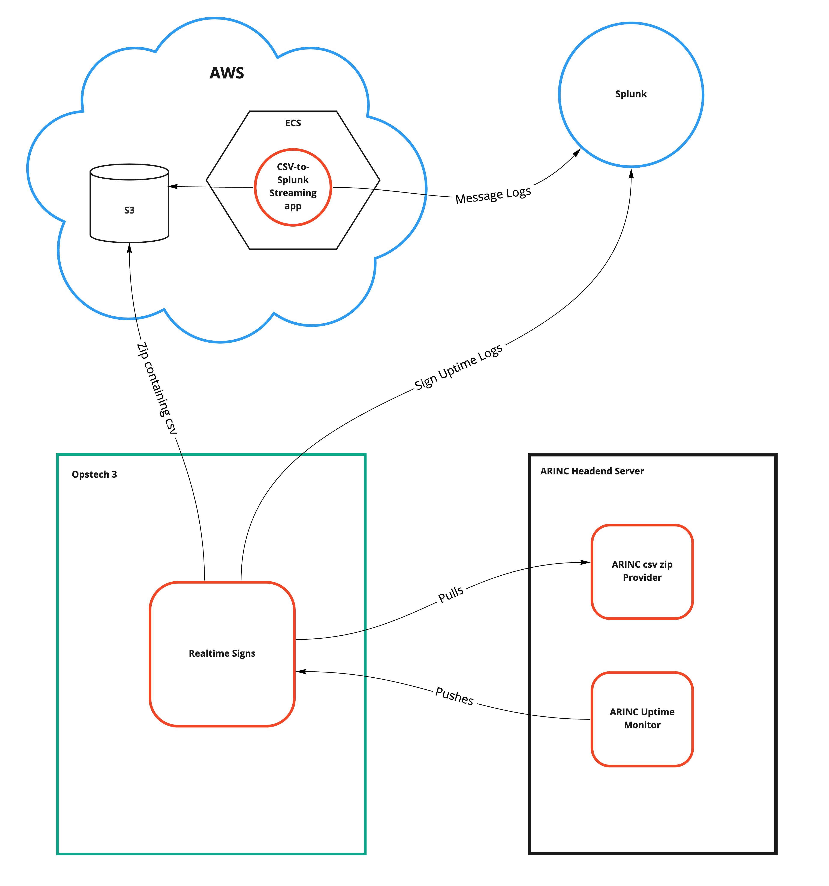
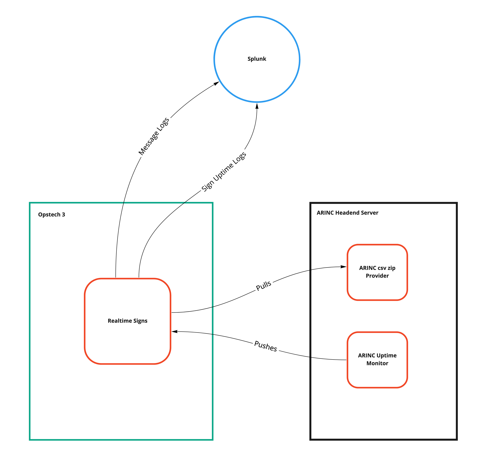

# PA/ESS Monitoring Data Consumption

## Motivation
Currently, the only way for us analyze performance of the PA/ESS system is to ask an Engineer at ARINC to fetch us headend server logs along with individual SCU logs for a given date. We then need to fetch our own Realtime Signs logs from Splunk and use a script to marry all this data together and perform an analysis. This manual process is inefficient and inconvenient for engineers on both sides. 

This makes it impossible for MBTA to have visbility into how the PA/ESS system is performing at any given time. We are aware that there are frequent and significant latencies that happen within the PA/ESS system, but we have little to no awareness of when and where these happen. We also have very weak capabilities in terms of understanding the online status of a given countdown clock and therefore largely rely on reports from station officials, riders, and CTD employees to know when we need to troubleshoot an offline sign.

ARINC is now working on providing to us the ability to request system-wide logs of visual PA/ESS messages on a nightly basis, as well as sign uptime "heartbeats". If CTD can begin consuming this data on a consistent basis, it will allow us to have significantly more insight into the status and performance of the PA/ESS system by giving us easier access to far more data than before and enabling us to build out monitoring dashboards.

## Goals 
There are two main goals in the scope of this tech spec because there are two separate ways we will be getting the data for message logs and sign uptime, respectively.

  1. Set up a recurring process that will request ARINC’s headend server on a nightly basis for a file containing message logs over the last 24 hours and then stream these logs into Splunk to be queried.
  2. Set up an endpoint for ARINC to send requests to CTD informing whether a given sign is up or down at some frequent interval (something like every 30 seconds – 1 Min)

The order in which these goals are accomplished is arbitrary, or they could be worked on in parallel.

## Proposed solution
### Part 1: Message Logs 

To give more context on the reasoning behind the solution proposed, we should note that Realtime Signs runs on opstech3 which has historically been prone to run out of memory and experience other performance issues. It's also worth noting that opstech3 is intended to be a DB server and not meant to host applications like Realtime Signs. Therefore, we should try to keep whatever new logic/features we add to Realtime Signs to be minimal. Also, it is to our advantage to host processing-heavy logic in AWS since that allows us to scale resources if we need to. We don't have that ability on opstech3.

To give a rough idea of the required resources for processing the message logs, the CSV files may be up to ~200MB which is based on the number of messages we send to ARINC over the course of a. While this ultimately isn’t a ton of data, we should note that this is only counting visual messages. We also send audio messages, but they are not able to be logged yet. If/when those are added, the number of rows in the CSV would at least double.

As a list of steps, the solution would involve the following in sequence: 

  1. ARINC builds out an application that filters out unneeded logs and compiles the data that we outlined in our specification. With CTD having improved the usability of the `uid` field that we send in our messages to the ARINC headend server, this is achievable now.

  2. ARINC sets up an endpoint for CTD to hit once per day around 2AM to receive a file containing the compiled logs. It would probably be good if the file is a zip to keep the size of data being transferred between servers small.

  3. CTD sets up a recurring job which calls ARINC’s endpoint nightly to receive the file and dump it into an S3 bucket. Having the logs stored in S3 also makes it convenient if we ever need to dig up past log files for some reason.

  4. CTD sets up an application that is responsible for pulling down the zip file from S3, unzipping it, and then streaming it into Splunk. There may be different options to explore on how to achieve this step. Splunk does not provide an easy way of uploading a CSV file. They do provide a mechanism called a Universal Forwarder meant for forwarding large amounts of data into Splunk, though past attempts at setting these up have not been successful at the CTD. A "brute force" option could be to stream the CSV and `Logger.log()` the rows into Splunk, but the amount of requests would be close to 600,000 for one CSV for visual messages only.

The main reason for standing up a new application would be to avoid resource consumption on opstech3 and it's an effort to host any new PA/ESS related features on AWS rather than on-prem servers.

An alternative, potentially simpler option could be to try streaming the CSV into Splunk directly from Realtime Signs and skip standing up an additional application since that will require some additional time and resources. We could still dump the zips or raw CSVs in S3 if we want to keep a record of what we receive from ARINC.

Once the data is in Splunk, we can implement dashboards/graphs/etc. to achieve station-level, system-wide monitoring of the PA/ESS messaging system on a trailing per-day basis.

### Part 2: Sign Uptime 

Currently, there are 500+ countdown signs across the MBTA. ARINC technically does have data stored and kept up-to-date in their database about whether these signs are online or not. ARINC’s engineer briefly demoed to us that they can provide an application which periodically pings a server with a message containing the online status of a sign. 

CTD can set up an endpoint (probably on Realtime Signs, but Screenchecker might be another option) that ARINC can point this application at which would take the contents of each request and format/log it into Splunk. Assuming ARINC sends us the status of each sign every 30 seconds, that would provide accurate enough awareness of sign status to respond quickly if a sign goes down.

If the requests are staggered across the 30 seconds for the 500 signs, that’s about 16-17 requests per second which should be easy to handle. This feature would essentially become a heartbeat for each countdown clock which we can then leverage to build out monitoring and alerting.

As a list of steps, the solution would involve the following in sequence: 

  1. CTD sets up an endpoint which expects requests from ARINC’s headend server detailing the status of a sign, and what station/zone the sign is. This endpoint simply needs to format and log the message into Splunk

  2. ARINC deploys an application which sends the uptime messages for all 500+ signs in the system at a rate of ~16-17 requests per second.

Once the data is in Splunk, we can implement dashboards/graphs/etc. to achieve monitoring of system-wide PA/ESS sign status at a 30 second interval.

## Diagram with new application

## Diagram without new application
